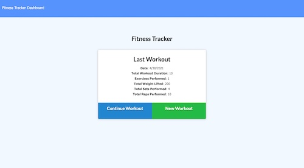
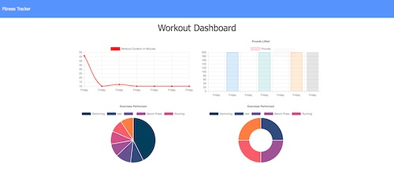

# Fitness Tracker

## Table of Contents
* [Description](README.md#Description)
* [Installation](README.md#Installation)
* [Usage](README.md#Usage)
* [URL](README.md#URL)
* [License](README.md#License)
* [Questions](README.md#Questions)

## Description
An app that allows users to create and track workouts. They can log multiple exercises on a given day and track name, type, weight, sets, reps, distance, and duration of an exercise.

## Installation
To install, clone this from my repository by entering git clone https://github.com/kelseysanderson/fitness_tracker.git in a terminal in a new directory. Then, when successfully cloned, type `npm install` in the terminal within that directory.

## Usage
Following installation, open the terminal in the new directory and enter `npm run watch` to start the server. Then open your browser and type in localhost:3000 into the address bar in a browser. The live URL can also be found below.

### Screenshot 

## URL
[Live URL to Fitness Tracker](https://fitness-tracker-ksanderson.herokuapp.com/?id=608ce0cc3099fd00159ae30f)

## License
Read more about the license here:
https://opensource.org/licenses/MIT

### Questions
If you have any questions, feel free to contact me:

GitHub: [Kelsey Sanderson GitHub](https://github.com/kelseysanderson)

Email:  [Kelsey Sanderson Email](mailto:kelseymonica@gmail.com)